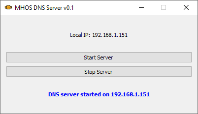

# Portable MH Oldschool DNS Server

If you're experiencing issues with our public DNS server, you can use this software to set up a local DNS server pre-configured to connect to all of our infrastructure, including game and DLC servers. Simply launch the app, start the server, and set your DNS to the local IP address displayed on your screen.

## How to build?

Install all the dependencies listed in `requirements.txt`, then install `pyinstaller` and run `pyinstaller main.spec`. Alternatively, you can download a precompiled version from the Releases section.

## Configuration

By default, our common domains are hardcoded into the app. However, you can place the `domains.conf` file next to the executable to extend its functionality by adding new domains or modifying the IP addresses. If no `domains.conf` file is found, the app will fallback to the hardcoded domain/IP pairs.
